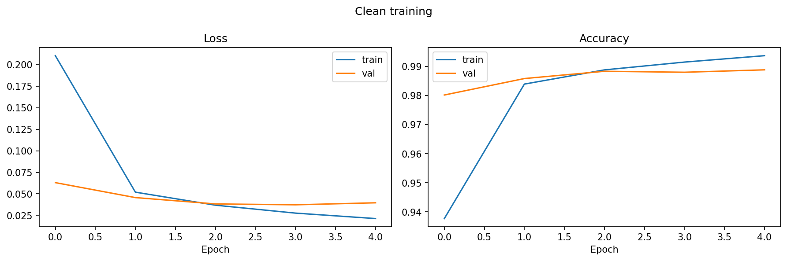
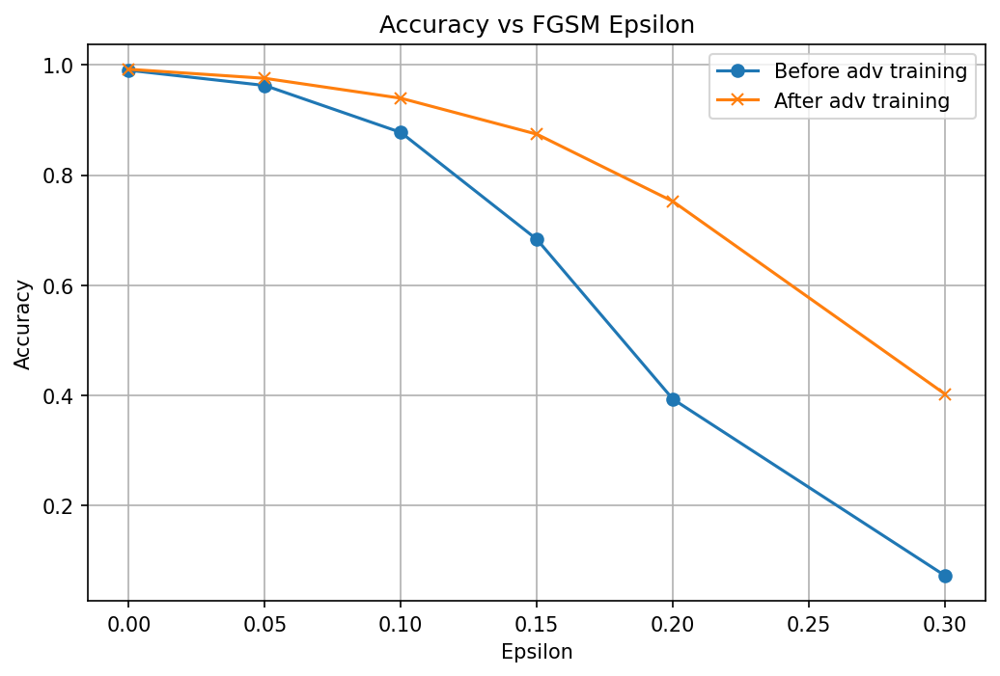
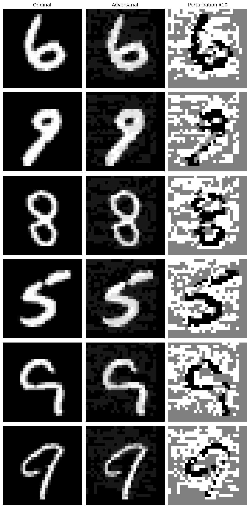
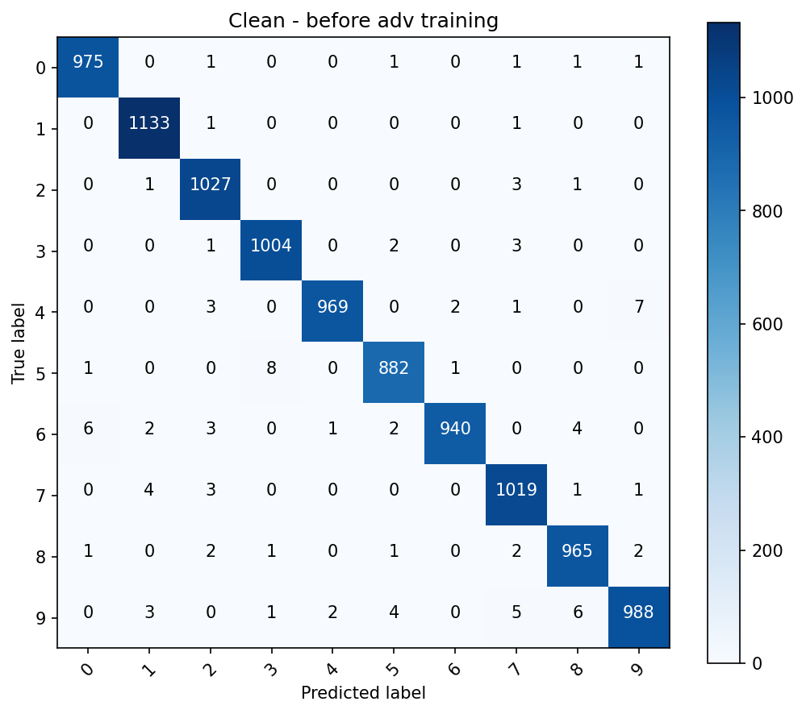
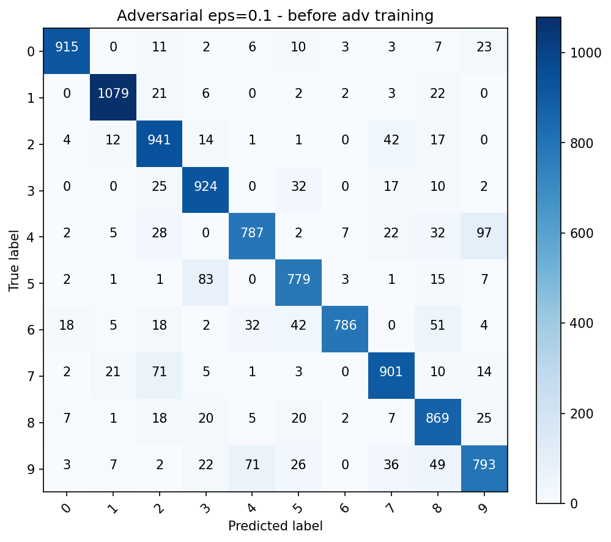

# MNIST Adversarial Robustness — CNN + FGSM

A deep learning project exploring adversarial attacks and defenses on the MNIST digit classification dataset using the **Fast Gradient Sign Method (FGSM)**.

---

## Overview

This project trains a convolutional neural network (CNN) on MNIST and investigates its vulnerability to adversarial perturbations. It then applies **adversarial training** as a defense and compares model robustness before and after.

**Key features:**
- Clean CNN training with validation, early stopping, and model checkpointing
- FGSM adversarial attack generation (batched, memory-efficient)
- Evaluation across multiple epsilon values with accuracy-vs-epsilon plots
- Side-by-side visualization of original, adversarial, and perturbation images
- Confusion matrices before and after adversarial training
- Experiment results saved to JSON for reproducibility

---

## Project Structure

```
.
├── mnist_fgsm_expanded.py     # Main script
├── cnn_mnist_fgsm.h5          # Saved clean model (generated on run)
├── cnn_mnist_fgsm_adv_trained.h5  # Saved adversarially trained model (generated on run)
├── experiment_results.json    # Accuracy comparison across epsilons (generated on run)
├── requirements.txt
└── README.md
```

---

## Quickstart

### 1. Clone the repo

```bash
git clone https://github.com/YOUR_USERNAME/YOUR_REPO_NAME.git
cd YOUR_REPO_NAME
```

### 2. Install dependencies

```bash
pip install -r requirements.txt
```

### 3. Run the experiment

```bash
python mnist_fgsm_expanded.py
```

The script will:
1. Download MNIST automatically via Keras
2. Train a clean CNN
3. Evaluate against FGSM attacks at multiple epsilon levels
4. Run adversarial training
5. Compare and visualize results

---

## Requirements

- Python 3.8+
- TensorFlow 2.x
- scikit-learn
- matplotlib
- numpy

See `requirements.txt` for pinned versions.

---

## Results Summary

| Epsilon | Before Adv. Training | After Adv. Training |
|---|---|---|
| 0.00 (clean) | 99.02% | 99.20% |
| 0.05 | 96.26% | 97.56% |
| 0.10 | 87.74% | 93.95% |
| 0.15 | 68.34% | 87.42% |
| 0.20 | 39.35% | 75.23% |
| 0.30 | 7.33% | 40.28% |

*(Fill in your actual values from `experiment_results.json` after running)*

---

## Plots

### Training History


### Accuracy vs Epsilon


### Adversarial Examples


### Confusion Matrices
| Clean | Adversarial (ε=0.1) |
|---|---|
|  |  |

---

## How FGSM Works

FGSM generates adversarial examples by taking a single gradient step in the direction that **maximizes the loss**:

```
x_adv = x + ε · sign(∇_x J(θ, x, y))
```

Where `ε` controls the perturbation magnitude. Larger `ε` causes more visible distortion but lower model accuracy.

---

## Adversarial Training

The defense used here is **data augmentation with adversarial examples**: the model is fine-tuned on a 50/50 mix of clean and FGSM-perturbed training images, encouraging the model to learn robust features.

---

## License

MIT
